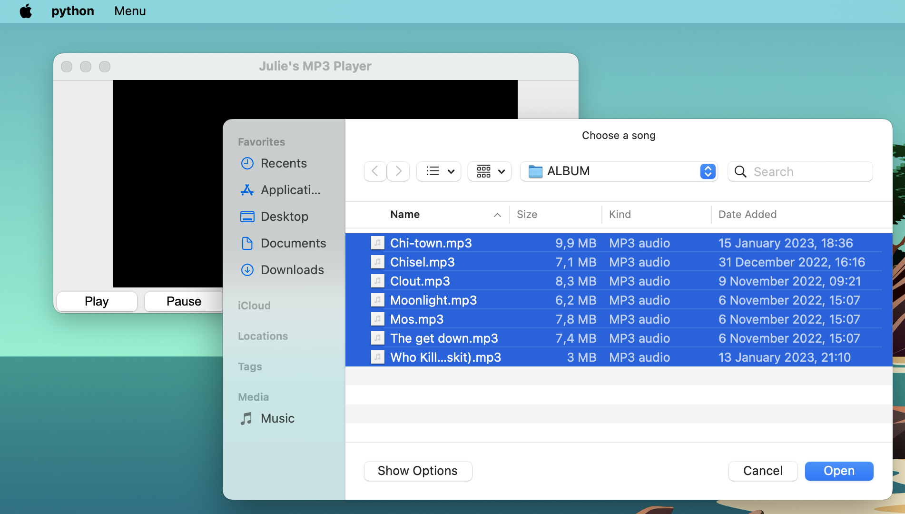

## Music Player

In this project, I created a music player using PyGame and Tkinter.

---

#### Description:
I decided to try and create an MP3 Player with Python after reading an interesting article on [Data Flair's blog](https://data-flair.training/).
It gave me the opportunity to learn more about Tkinter, which I definitely want to use in other future projects!

Here are some screenshots of the music player:

